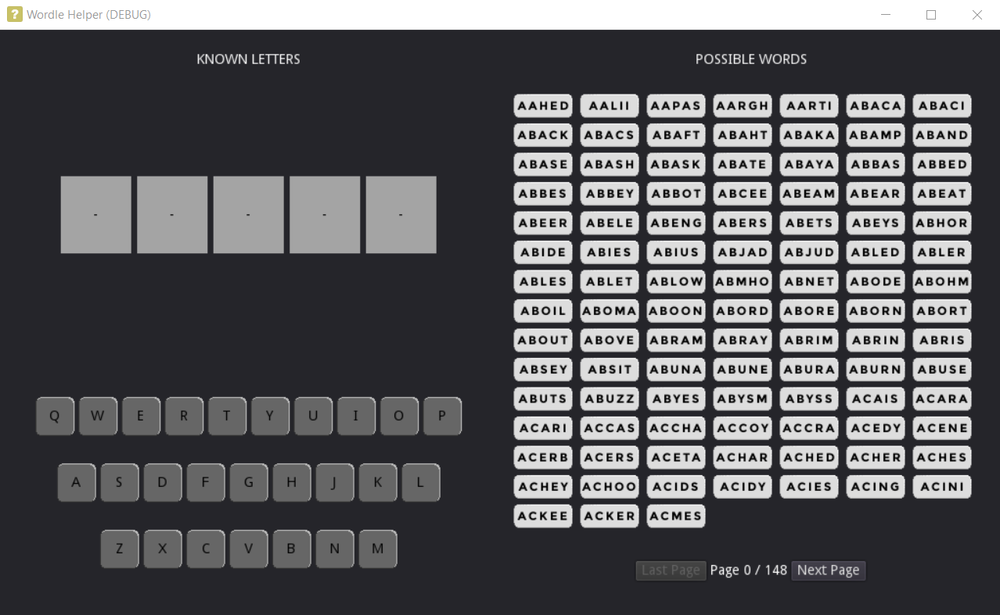

### WordleHelper
Can't think of a word with what you've got? Let WordleHelper help you.

## Status
Pre-Alpha

## Current Features
- An intuitive UI appearance
- A paginated list of all available words that updates based on keyboard marks (see below)
- A keyboard that marks letters as active (in the word) or inactive (not in the word)

## TO DO
- Add ability to fill letters into letter positions (click and type)
- Get letter positions and update wordlist
- Mark loading progress when doing lots of calculations